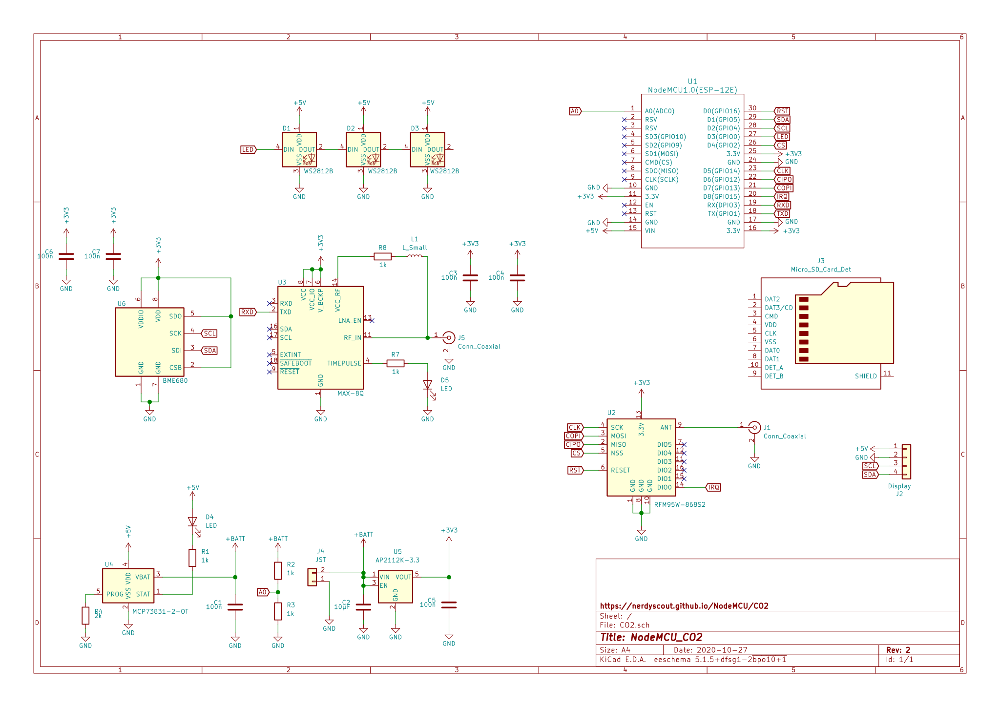

# NodeMCU_CO2

Shield for the NodeMCU_ESP8266 for builing a CO2 measurment device.

## Schematic

## Layout
 

## Documentation 
- Assemble all parts according [BOM](gerbers/CO2_BOM_CO2.csv)

#### Software
tbd
