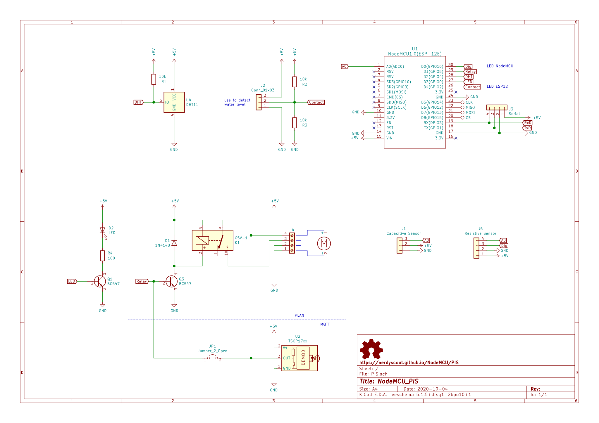

# NodeMCU_IR

IR-MQTT bridge

## Schematic

## Layout
 

## Assembling
- Assemble all parts according [BOM](../PIS/gerbers/PIS_BOM_IR.csv)
  - make R4 fit to your LED, it might be even 0Ohm
  - close JP1

## Software
Just use [Tasmota](https://github.com/arendst/Tasmota) and 
todo: further description

