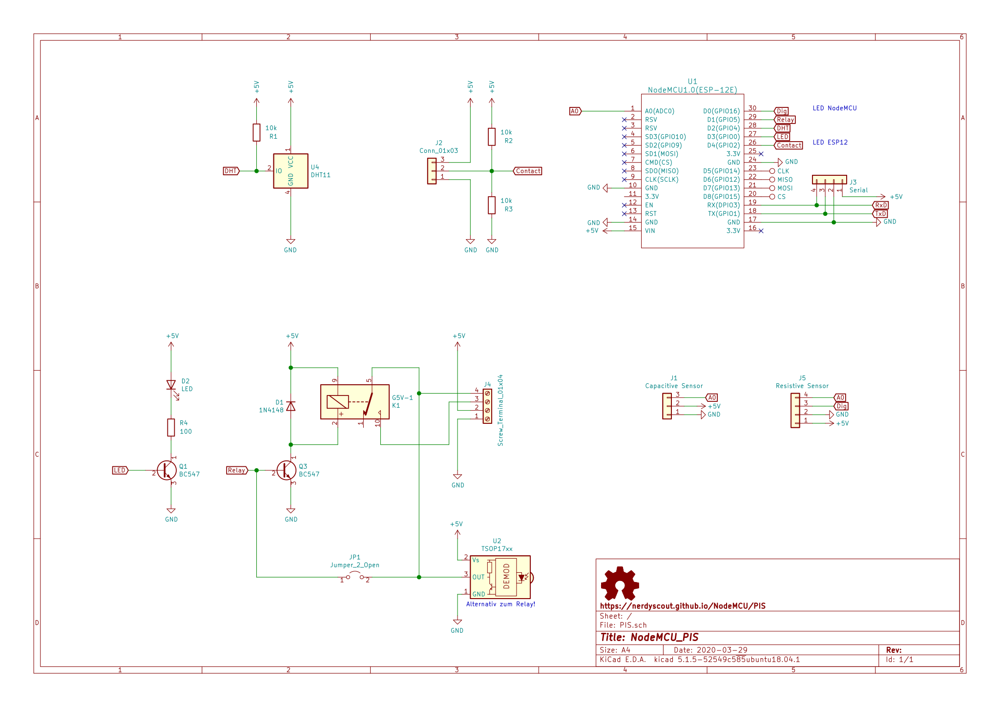
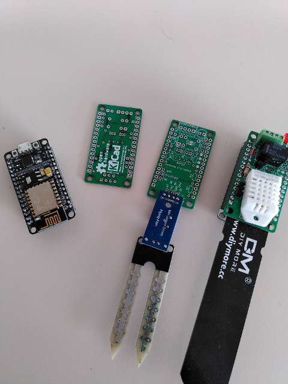
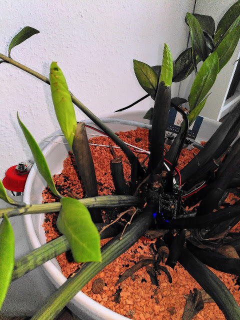
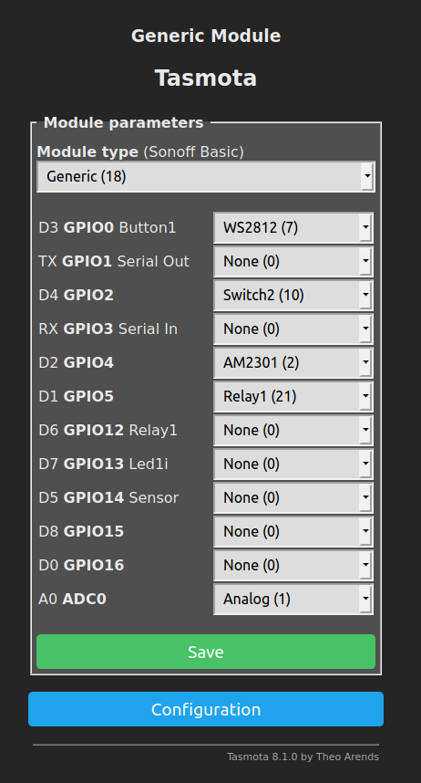

# NodeMCU_PIS

Plant Irrigation Shield for the NodeMCU_Amica.

## Schematic
[](PIS.pdf)

## Documentation

This PCB can be assembled in two variants with complete independent functions.

### Variant: Plant Irrigation System

#### Assembling

 

- Assemble all parts according [BOM](PIS_bom.csv)
  - there are some slight more variants depending if you want to use an capacetive or resestive soil moisture sensor
  - the status LED is optional
  - the pullup/pulldown resistors should only be placed if needed 
  - leave JP1 open

#### Software

you could run [Tasmota](https://github.com/arendst/Tasmota) and set a few configurations



and set some extra parameter in console

```
# set nominal value
mem1 750

# turn pump on/off depending mem value
Rule1 on analog#a0>%mem1% do power1 1 endon on analog#a0<%mem1% do power1 0 endon 

# turn rule1 off when water empty // todo: turn status LED on
Rule2 on Power2#State=0 do Rule1 1 endon on Power2#State=1 do Backlog Rule1 0; Power1 0 endon

Rule1 on
Rule2 on
```

Changing mem1 value (can also be done via MQTT) results in new nominal value, every plant may need other value depending on size, soil, sunlight, ... so you need to play a bit to find a good value. 

### Variant: Powerfull Infrared Span

this is an MQTT-IR Bridge

#### Assembling

- Assemble all parts according [BOM](PIS_bom.csv)
  - make R4 fit to your LED, it might be even 0Ohm
  - close JP1

#### Software

Just use [Tasmota](https://github.com/arendst/Tasmota) and 
todo: further description

